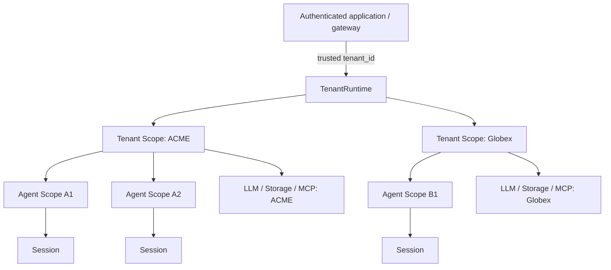

<div align="center">

# dsh-tenancy

**The missing tenant scope for DeepSeek Harness.**

Run multiple logical tenants in one DSH process with explicit scope inheritance,
resource routing, session ownership, and default-deny plugin admission.

[](https://github.com/neilzhangpro/dsh-tenancy)
[](LICENSE)
[](package.json)
[](package.json)
[](progress.md)

[English](README.md) · [简体中文](README.zh-CN.md) · [Protocol](docs/tenancy-protocol.md) · [Security](SECURITY.md)

</div>

> [!IMPORTANT]
> dsh-tenancy provides application-level tenant scoping and admission controls.
> It is **not a sandbox** and does not make arbitrary Node.js plugins safe to
> execute in a shared process.

## Why dsh-tenancy?

DeepSeek Harness already has global process state, Cordis plugin lifecycle,
session persistence, and per-agent scopes. It does not have a first-class tenant
boundary shared by multiple agents.

```text
Before: Global → Agent
After:  Global → Tenant → Agent → Session
```

dsh-tenancy fills that gap with a small, fail-closed protocol:

- explicit and validated tenant identity;
- tenant → agent scope inheritance with local shadowing;
- cross-tenant registration and session isolation;
- versioned tenant-aware plugin declarations;
- per-tenant LLM, credential, storage, and MCP contracts;
- framework-neutral HTTP/JWT and PostgreSQL integration seams.

## Architecture



Registrations resolve from the nearest scope outward:

```text
agent registration → tenant registration → global registration
```

## Tech stack

<p>
  
  
  
  
  
</p>

- TypeScript with strict type checking
- Node.js 20+ and native `node:test`
- npm workspaces and project references
- Adapter-based integration with DSH/Cordis, PostgreSQL, vaults, and identity providers
- Zero runtime dependencies outside the workspace packages

## Packages

| Package | Version | Purpose |
|---|---:|---|
| `@dsh-tenancy/core` | 0.1.0 | Tenant IDs, runtime, scopes, plugin admission, and session ownership |
| `@dsh-tenancy/testing` | 0.1.0 | Reusable tenant-aware plugin compliance checks |
| `@dsh-tenancy/llm` | 0.2.0 | LLM profiles, credential references, secret resolution, and client routing |
| `@dsh-tenancy/storage` | 0.2.0 | Safe tenant namespaces and an in-memory reference adapter |
| `@dsh-tenancy/integrations` | 0.3.0 | HTTP, verified JWT claims, PostgreSQL ownership, and MCP routing |

> The packages are currently developed as a monorepo. Check the repository
> releases before depending on a package from the public npm registry.

## Quick start

### Requirements

- Node.js 20 or newer
- npm 11 or a compatible npm version with workspace support

### Install and verify

```bash
git clone https://github.com/neilzhangpro/dsh-tenancy.git
cd dsh-tenancy
npm install
npm run verify
```

### Run the demos

```bash
npm run demo
```

The demo proves tenant tool isolation, credential routing, session ownership,
legacy-plugin rejection, and HTTP/JWT context propagation in one command.

## Usage

### Create and enter tenant scope

```ts
import { TenantRuntime, createMemoryScopeAdapter } from '@dsh-tenancy/core'

const tenants = new TenantRuntime(createMemoryScopeAdapter())

await tenants.run('tenant-acme', async (tenant) => {
  const agent = tenants.createAgent(tenant)
  agent.scope.register('crm', acmeCrm)

  // Pass agent.scope/native scope into the DSH Agent setup or placement seam.
})
```

### Declare a tenant-aware plugin

```ts
import type { TenantAwarePlugin } from '@dsh-tenancy/core'

export const crmPlugin: TenantAwarePlugin = {
  name: 'acme-crm',
  tenancy: { awareness: 'tenant', protocol: 1 },
  apply(ctx) {
    ctx.scope.register('crm', createTenantClient(ctx.tenant.id))
    return () => closeTenantClient(ctx.tenant.id)
  },
}
```

Plugins without a supported declaration are rejected by default:

```text
TenantPluginRejectedError:
plugin "legacy-memory" is not declared tenant-aware
```

### Route an LLM call without exposing credentials

```ts
import {
  CredentialRef,
  MemoryTenantCredentialResolver,
  MemoryTenantLlmResolver,
  TenantLlmRouter,
} from '@dsh-tenancy/llm'

const profiles = new MemoryTenantLlmResolver()
const credentials = new MemoryTenantCredentialResolver()
const router = new TenantLlmRouter(profiles, credentials)

profiles.set(tenant.id, {
  provider: 'openai-compatible',
  model: 'deepseek-chat',
  credentialRef: CredentialRef('vault/tenants/acme/llm'),
  version: '1',
})
```

See [Resource contracts](docs/resource-contracts.md) for the complete routing
and storage examples.

## Security model

dsh-tenancy protects operations performed through its contracts:

- scope registration visibility;
- live tenant-context validation;
- plugin admission and lifecycle cleanup;
- session ownership and PostgreSQL claim races;
- LLM client/cache partitioning, storage namespaces, and MCP routes.

It does not authenticate callers, validate JWT signatures by itself, secure
database or vault infrastructure, restrict filesystem/network/process access,
or sandbox plugin code. Read the [threat model](docs/threat-model.md) and
[security policy](SECURITY.md) before production use.

## Documentation

| Document | Description |
|---|---|
| [Tenancy protocol](docs/tenancy-protocol.md) | Protocol v1 declarations and runtime invariants |
| [Resource contracts](docs/resource-contracts.md) | LLM, credential, and storage contracts |
| [Integration guide](docs/integration-guide.md) | DSH/Cordis agent placement integration |
| [v0.3 integrations](docs/integrations.md) | HTTP, JWT, PostgreSQL, and MCP adapters |
| [Plugin author guide](docs/plugin-author-guide.md) | How to write and test tenant-aware plugins |
| [Threat model](docs/threat-model.md) | Guarantees, assumptions, and non-goals |
| [Security policy](SECURITY.md) | Vulnerability reporting and security boundary |

## Development

```bash
npm run check   # strict TypeScript build
npm test        # all Node.js tests
npm run demo    # executable integration demos
npm run verify  # complete required verification
```

Every isolation or admission change must include a negative test. Project state
and verification evidence live in [`feature_list.json`](feature_list.json) and
[`progress.md`](progress.md).

## Roadmap

- [x] **v0.1 — Scope and admission:** runtime, hierarchy, ownership, protocol
- [x] **v0.2 — Resource contracts:** LLM, credential, storage, memory adapters
- [x] **v0.3 — Integrations:** HTTP/JWT, PostgreSQL ownership, MCP routing
- [ ] **v1.0 — Stable protocol:** compatibility policy, lifecycle audit,
  concurrency benchmarks, upstream placement seam, independent security review

## Contributing

Issues and pull requests are welcome. Before opening a pull request:

1. read [`AGENTS.md`](AGENTS.md) and the relevant protocol documentation;
2. keep the change focused on one feature;
3. add positive and negative tests;
4. run `npm run verify` and record relevant evidence;
5. clearly document security-boundary changes.

Use [GitHub Issues](https://github.com/neilzhangpro/dsh-tenancy/issues) for bugs
and proposals. Report vulnerabilities according to [`SECURITY.md`](SECURITY.md),
not through a public issue.

## License

Released under the [MIT License](LICENSE).
