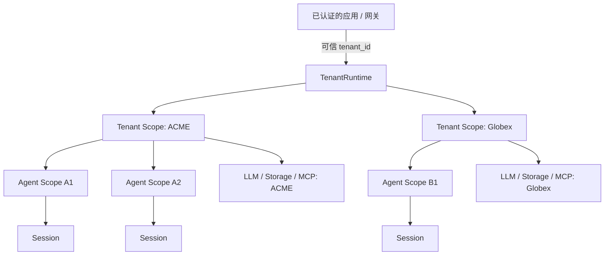

<div align="center">

# dsh-tenancy

**为 DeepSeek Harness 补上缺失的租户作用域。**

让一套 DSH 进程安全承载多个逻辑租户，并提供显式作用域继承、资源路由、
Session 所有权和默认拒绝的插件准入机制。

[](https://github.com/neilzhangpro/dsh-tenancy)
[](LICENSE)
[](package.json)
[](package.json)
[](progress.md)

[English](README.md) · [简体中文](README.zh-CN.md) · [协议](docs/tenancy-protocol.md) · [安全策略](SECURITY.md)

</div>

> [!IMPORTANT]
> dsh-tenancy 提供应用级租户作用域和插件准入控制。它**不是代码沙箱**，
> 也不会让任意 Node.js 插件在共享进程中自动变得安全。

## 为什么需要 dsh-tenancy？

DeepSeek Harness 已经具备全局进程状态、Cordis 插件生命周期、Session
持久化和 per-Agent scope，但缺少一个可供多个 Agent 共享的一等租户边界。

```text
改造前：Global → Agent
改造后：Global → Tenant → Agent → Session
```

dsh-tenancy 用一个小型、默认拒绝的协议补齐这一层：

- 显式且经过验证的租户身份；
- Tenant → Agent 作用域继承和就近覆盖；
- 跨租户 registration 与 Session 隔离；
- 带版本的 tenant-aware 插件声明；
- 面向 LLM、凭据、Storage 和 MCP 的租户契约；
- 框架无关的 HTTP/JWT 和 PostgreSQL 集成接口。

## 架构



注册项按照从近到远的顺序解析：

```text
Agent registration → Tenant registration → Global registration
```

## 技术栈

<p>
  
  
  
  
  
</p>

- TypeScript 严格类型检查
- Node.js 20+ 与原生 `node:test`
- npm workspaces 与 TypeScript project references
- 基于 Adapter 对接 DSH/Cordis、PostgreSQL、Vault 和身份提供方
- 除 workspace 内部包之外，运行时零依赖

## 包结构

| 包 | 版本 | 用途 |
|---|---:|---|
| `@dsh-tenancy/core` | 0.1.0 | Tenant ID、Runtime、Scope、插件准入、Session 所有权 |
| `@dsh-tenancy/testing` | 0.1.0 | 可复用的 tenant-aware 插件合规测试 |
| `@dsh-tenancy/llm` | 0.2.0 | LLM Profile、凭据引用、Secret 解析和 Client 路由 |
| `@dsh-tenancy/storage` | 0.2.0 | 安全租户 Namespace 和内存参考实现 |
| `@dsh-tenancy/integrations` | 0.3.0 | HTTP、已验证 JWT Claims、PostgreSQL 和 MCP |
| `dsh-plugin-tenancy` | 0.3.0 | 提供 `ctx.tenants` 和 `ctx.tenantSessions` 的可安装 DSH Bundle |

> 当前以 Monorepo 形式开发这些包。从公共 npm registry 引用前，请先检查
> 仓库 Releases 中的发布状态。

## 快速开始

### 环境要求

- Node.js 20 或更高版本
- npm 11，或其他支持 workspace 的兼容 npm 版本

### 安装并验证

```bash
git clone https://github.com/neilzhangpro/dsh-tenancy.git
cd dsh-tenancy
npm install
npm run verify
```

### 运行 Demo

```bash
npm run demo
```

Demo 会在一条命令中展示租户工具隔离、凭据路由、Session 所有权、旧插件
拒绝，以及 HTTP/JWT Tenant Context 传播。

### 运行可视化 Tenant Lab

```bash
npm run demo:dashboard
# 打开 http://localhost:4173
```

Tenant Lab 会签发仅用于本地演示的短期 JWT，通过 HTTP Middleware 路由请求，
并允许直接挂载/卸载每个租户插件。生产环境应替换为身份服务和 JWKS 验签器。

### 安装 DSH Bundle

在包发布到 npm 之前，可先构建自包含 tarball 并安装到 DSH Profile：

```bash
npm run build
npm pack --workspace dsh-plugin-tenancy
dsh plugin --profile web add ./dsh-plugin-tenancy-0.3.0.tgz
dsh --profile web --dump-config
```

该 Bundle 已在全新 `DSH_HOME` 中使用 `@deepseek-ai/dsh@0.1.1-rc.2`
完成启动冒烟测试。编译入口已内联 core runtime，不包含需要从 registry
下载的运行时依赖。卸载命令：

```bash
dsh plugin --profile web remove dsh-plugin-tenancy
```

## 使用方式

### 创建并进入 Tenant Scope

```ts
import { TenantRuntime, createMemoryScopeAdapter } from '@dsh-tenancy/core'

const tenants = new TenantRuntime(createMemoryScopeAdapter())

await tenants.run('tenant-acme', async (tenant) => {
  const agent = tenants.createAgent(tenant)
  agent.scope.register('crm', acmeCrm)

  // 将 agent.scope/native scope 传入 DSH Agent setup 或 placement seam。
})
```

### 声明 tenant-aware 插件

```ts
import type { TenantAwarePlugin } from '@dsh-tenancy/core'

export const crmPlugin: TenantAwarePlugin = {
  name: 'acme-crm',
  tenancy: { awareness: 'tenant', protocol: 1 },
  apply(ctx) {
    ctx.scope.register('crm', createTenantClient(ctx.tenant.id))
    return () => closeTenantClient(ctx.tenant.id)
  },
}
```

没有受支持声明的插件会被默认拒绝：

```text
TenantPluginRejectedError:
plugin "legacy-memory" is not declared tenant-aware
```

### 路由 LLM 调用且不暴露凭据

```ts
import {
  CredentialRef,
  MemoryTenantCredentialResolver,
  MemoryTenantLlmResolver,
  TenantLlmRouter,
} from '@dsh-tenancy/llm'

const profiles = new MemoryTenantLlmResolver()
const credentials = new MemoryTenantCredentialResolver()
const router = new TenantLlmRouter(profiles, credentials)

profiles.set(tenant.id, {
  provider: 'openai-compatible',
  model: 'deepseek-chat',
  credentialRef: CredentialRef('vault/tenants/acme/llm'),
  version: '1',
})
```

完整 LLM 路由和 Storage 示例参见[资源契约](docs/resource-contracts.md)。

## 安全模型

dsh-tenancy 保护通过其契约完成的操作：

- Scope registration 可见性；
- 活跃 Tenant Context 校验；
- 插件准入和生命周期清理；
- Session 所有权和 PostgreSQL 并发 claim；
- LLM Client/Cache 分区、Storage Namespace 和 MCP 路由。

它不负责认证调用者、自行验证 JWT 签名、保护数据库或 Vault 基础设施、
限制文件系统/网络/进程访问，也不提供插件代码沙箱。生产使用前请阅读
[威胁模型](docs/threat-model.md)和[安全策略](SECURITY.md)。

## 文档

| 文档 | 说明 |
|---|---|
| [Tenancy 协议](docs/tenancy-protocol.md) | Protocol v1 声明和 Runtime 不变量 |
| [资源契约](docs/resource-contracts.md) | LLM、Credential 和 Storage 契约 |
| [集成指南](docs/integration-guide.md) | DSH/Cordis Agent placement 和 Agent Bridge 集成 |
| [v0.3 集成](docs/integrations.md) | HTTP、JWT、PostgreSQL 和 MCP Adapter |
| [v1 兼容策略](docs/v1-compatibility.md) | 协议和包版本兼容策略 |
| [插件开发指南](docs/plugin-author-guide.md) | 编写和测试 tenant-aware 插件 |
| [威胁模型](docs/threat-model.md) | 保证、假设和非目标 |
| [安全策略](SECURITY.md) | 漏洞报告和安全边界 |

## 开发

```bash
npm run check   # TypeScript 严格编译
npm test        # 全部 Node.js 测试
npm run demo    # 可执行集成 Demo
npm run verify  # 完整必要验证
```

每个隔离或准入变更都必须包含负面测试。项目状态和验证证据记录在
[`feature_list.json`](feature_list.json)和[`progress.md`](progress.md)中。

## 路线图

- [x] **v0.1 — Scope 与准入：** Runtime、层级、所有权、协议
- [x] **v0.2 — 资源契约：** LLM、Credential、Storage、内存 Adapter
- [x] **v0.3 — 集成：** HTTP/JWT、PostgreSQL ownership、MCP 路由
- [ ] **v1.0 — 稳定协议：** 兼容性策略、生命周期审计、并发 Benchmark、
  上游 placement seam、独立安全评审

## 参与贡献

欢迎提交 Issue 和 Pull Request。发起 PR 前请：

1. 阅读 [`AGENTS.md`](AGENTS.md)和相关协议文档；
2. 每次变更只聚焦一个功能；
3. 添加正向和负向测试；
4. 运行 `npm run verify` 并记录相关证据；
5. 清楚说明对安全边界的影响。

Bug 和提案请使用 [GitHub Issues](https://github.com/neilzhangpro/dsh-tenancy/issues)。
安全漏洞请按照 [`SECURITY.md`](SECURITY.md)私下报告，不要创建公开 Issue。

## 许可证

本项目基于 [MIT License](LICENSE) 发布。
